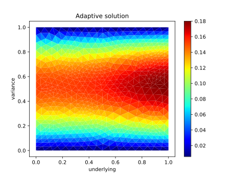

# Finite Element Options

Finite Element Options demonstrates pricing of European options under various
stochastic models using a finite element discretisation. The application is
built around [scikit-fem](https://github.com/kinnala/scikit-fem) and provides a
Streamlit-based user interface for interactive exploration.

## Quickstart

Install the dependencies and run a simple Black–Scholes pricing example:

```bash
pip install -r requirements.txt
python - <<'PY'
from src.examples.bs_1d import price_call
grid = price_call()
print(grid[-1])  # option values at maturity
PY
```

The snippet solves a one-dimensional Black–Scholes problem using default
parameters and prints the final price grid.

Mesh creation utilities now return both the mesh and a ``Config`` instance
carrying numerical parameters such as the finite element. Pass this
configuration to ``SpaceSolver`` when constructing spatial discretisations.

Alternatively, run the bundled example script:

```bash
python examples/basic_usage.py
```

This reproduces the same call option pricing workflow in a standalone file.

## Features

- Black-Scholes option pricer with call and put payoffs
- Finite-difference solver on regular grids using ``findiff``
- Numba prototypes for accelerating payoff evaluation
- Greek estimators (Delta, Gamma, Vega) via finite differences
- Experimental JAX-based Greek computation via automatic differentiation
- Configurable mesh generation supporting 1D, 2D and 3D problems
- Central ``Config`` dataclass for numerical parameters
- Sample problems for 1D Black–Scholes and 3D Heston models
- Simple market abstraction with discount factors
- Streamlit UI and plotting helpers
- Example demo for adaptive mesh refinement
- Comprehensive test suite using `pytest`
- Parameter calibration helpers with SciPy, Statsmodels and Bayesian PyMC approaches
- Market data handled via pandas DataFrames and solution snapshots via xarray
- CSV/Parquet serialisation utilities for reproducible experiments
- Experimental FEniCSx solver for Black-Scholes PDE

## Installation

```bash
pip install -r requirements.txt
```

## Usage

Launch the Streamlit application:

```bash
streamlit run main.py
```

Run the adaptive mesh demo:

```bash
python demo_adaptive.py
```

### Python API example

Interact with the building blocks directly to assemble a pricing pipeline and
observe how market data, dynamics, payoffs, spatial discretisation, and
timestepping interact:

```python
import numpy as np

from src.core.dynamics_black_scholes import DynamicsParametersBlackScholes
from src.core.market import Market
from src.core.vanilla_bs import EuropeanOptionBs
from src.space.mesh import create_mesh
from src.space.solver import SpaceSolver
from src.space.boundary import DirichletBC
from src.time.stepper import ThetaScheme
from src.jax_greeks import compute_greeks
from skfem import Function

# 1. Define market and model parameters
market = Market(r=0.03)
dynamics = DynamicsParametersBlackScholes(r=market.r, q=0.0, sig=0.2)
option = EuropeanOptionBs(k=1.0, q=dynamics.q, mkt=market)

# 2. Build the spatial problem (mesh + finite element space)
mesh, config = create_mesh(extents=[2.0], refine=5)
call_space = SpaceSolver(
    mesh=mesh,
    dynamics=dynamics,
    payoff=option,
    is_call=True,
    config=config,
)

# 3. March the forward-time PDE using a θ-scheme (Crank–Nicolson here)
time_grid = np.linspace(0.0, 1.0, 80)
solver = ThetaScheme(theta=0.5)
call_grid = solver.solve(time_grid, call_space, boundary_condition=DirichletBC([]))
call_fn = Function(call_space.Vh, call_grid[-1])
call_price = float(call_fn(np.array([[1.0]])))  # price at S=1

# 4. Reuse the same components for a put payoff
put_space = SpaceSolver(
    mesh=mesh,
    dynamics=dynamics,
    payoff=option,
    is_call=False,
    config=config,
)
put_grid = solver.solve(time_grid, put_space, boundary_condition=DirichletBC([]))
put_fn = Function(put_space.Vh, put_grid[-1])
put_price = float(put_fn(np.array([[1.0]])))

# 5. Compare numerical results with analytic Greeks for sanity checks
delta, vega = compute_greeks(
    s=1.0,
    k=option.k,
    r=market.r,
    q=option.q,
    sigma=dynamics.sig,
    t=time_grid[-1],
)

print(f"European call: price={call_price:.4f}, delta={delta:.4f}, vega={vega:.4f}")
print(f"European put:  price={put_price:.4f}")
```

### Example Output

The adaptive mesh demo refines the domain around sharp features. The final
solution after several refinement steps is shown below:



## Testing

Execute the unit tests with `pytest`:

```bash
pytest
```

Benchmarks leveraging `pytest-benchmark` can be executed alongside the test
suite. Coverage reports are generated via `pytest-cov`:

```bash
pytest --cov=src
```

## Benchmarking

Solver performance is tracked with `pytest-benchmark`.  Run the dedicated
benchmark suite locally to measure runtime on a fixed mesh:

```bash
pytest tests/test_benchmark_black_scholes.py --benchmark-only
```

Results can be saved for comparison and analysed with `pytest-benchmark compare`.
See [docs/benchmarking.md](docs/benchmarking.md) for details on
interpreting the output and contrasting runs.

### FEniCSx Spike

An experimental `FenicsSolver` mirrors the existing scikit-fem backend using
FEniCSx and UFL. On the Black–Scholes test problem the scikit-fem solver runs
in roughly 2 ms per step on this environment. FEniCSx wheels are unavailable for
Python 3.11, so its performance could not be measured here. The solver is
therefore an optional dependency and currently best treated as a preview for a
potential future migration.

## Continuous Integration

This project uses a GitHub Actions workflow to run the test suite on every
push and pull request, ensuring that the codebase remains reliable.

## Project Structure

```
src/            Core library modules
main.py         Streamlit entry point
requirements.txt  Project dependencies
tests/          Pytest-based test suite
```

## Roadmap

See [docs/ROADMAP.md](docs/ROADMAP.md) for development guidelines and prompt templates.

## License

This project is provided as-is without warranty.
