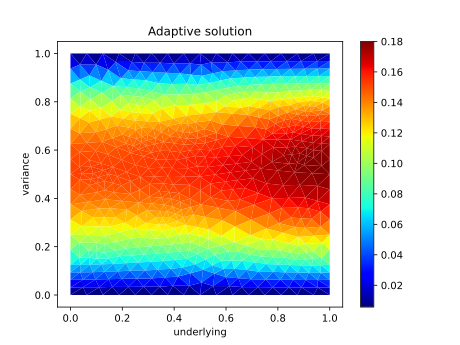

# Finite Element Options

Finite Element Options demonstrates pricing of European options under various
stochastic models using a finite element discretisation. The application is
built around [scikit-fem](https://github.com/kinnala/scikit-fem) and provides a
Streamlit-based user interface for interactive exploration.

## Quickstart

Install the dependencies and run a simple Black–Scholes pricing example:

```bash
pip install -e '.[validation]'
python - <<'PY'
from finite_element_options.examples.bs_1d import price_call
grid = price_call()
print(grid[-1])  # option values at maturity
PY
```

The snippet solves a one-dimensional Black–Scholes problem using default
parameters and prints the final price grid.

Mesh creation utilities now return both the mesh and a ``Config`` instance
carrying numerical parameters such as the finite element. Pass this
configuration to ``SpaceSolver`` when constructing spatial discretisations.

Alternatively, run the bundled installed-package example module:

```bash
python -m finite_element_options.examples.basic_usage
```

This reproduces the same call option pricing workflow without depending on a checkout-local `examples/` tree.

## Features

- Black-Scholes option pricer with call/put payoffs, explicit volatility vs. variance APIs, and tested zero-maturity/zero-volatility limits
- Finite-difference solver on regular grids using ``findiff``
- Greek estimators (Delta, Gamma, volatility Vega) via finite differences
- Experimental JAX-based Greek computation via automatic differentiation
- Configurable mesh generation supporting 1D, 2D and 3D problems
- Central ``Config`` dataclass for numerical parameters
- Sample problems for 1D Black–Scholes and 3D Heston models
- Simple market abstraction with discount factors
- Streamlit UI and plotting helpers
- Example demo for adaptive mesh refinement
- Comprehensive test suite using `pytest`
- Parameter calibration helpers with SciPy, Statsmodels and Bayesian PyMC approaches
- Market data handled via pandas DataFrames and solution snapshots via xarray
- CSV/Parquet serialisation utilities for reproducible experiments
- Experimental FEniCSx solver for Black-Scholes PDE
- Public-synthetic QuantProblemSpec FEM adapter manifest and `fem-bs-001` Black-Scholes parity fixture for cross-repo Haircut Engine and arxiv-lab compatibility checks. The published contract artifacts are in `tests/fixtures/fem_bs_001/`.
- Public-synthetic Pinares fixed-price option weak-form proxy fixture (`PINARES-FEM-FIXED-PRICE-PROXY-V0`) with UF units, survival-scaled terminal payoff, Lagrange-P2 line mesh evidence and fail-closed full-deal diagnostics in `tests/fixtures/fem_pinares_fixed_price_proxy_v1/`.

## Installation

The core wheel uses the real `finite_element_options` package namespace and keeps optional stacks out of the base install:

```bash
pip install .
```

Install development/test tooling with:

```bash
pip install -e '.[dev]' -c constraints.txt
```

Optional profiles are published as extras, for example `.[ui]`, `.[jax]`, `.[calibration]`, `.[io]`, `.[fd]`, and `.[validation]`.

## Architecture and module ownership

The CI-enforced architecture contract is `docs/architecture_contract.toml`. It records the `finite_element_options` source-layout package topology, optional-stack import boundaries, and the module ownership table used by `docs/MODULE_OWNERSHIP.md` for issue #50. Treat the base install as the FEM core; finite-difference compatibility uses the `fd` extra, calibration uses `calibration`, JAX Greeks use `jax`, IO/dataframe helpers use `io`, and UI/plotting code uses `ui` or `viz`.

## Usage

Launch the Streamlit application from the installed package tree:

```bash
streamlit run "$(python -c 'import importlib.util; print(importlib.util.find_spec("finite_element_options.examples.streamlit_app").origin)')"
```

Run the adaptive mesh demo:

```bash
python -m finite_element_options.examples.adaptive_mesh_refinement
```

### Python API example

Interact with the building blocks directly to assemble a pricing pipeline and
observe how market data, dynamics, payoffs, spatial discretisation, and
timestepping interact:

```python
import numpy as np

from finite_element_options.core.dynamics_black_scholes import DynamicsParametersBlackScholes
from finite_element_options.core.market import Market
from finite_element_options.core.vanilla_bs import EuropeanOptionBs
from finite_element_options.space.mesh import create_mesh
from finite_element_options.space.solver import SpaceSolver
from finite_element_options.space.boundary import DirichletBC
from finite_element_options.time_integration.stepper import ThetaScheme
from finite_element_options.jax_greeks import compute_greeks
from skfem import Function

# 1. Define market and model parameters
market = Market(r=0.03)
dynamics = DynamicsParametersBlackScholes(r=market.r, q=0.0, sig=0.2)
option = EuropeanOptionBs(k=1.0, q=dynamics.q, mkt=market)

# 2. Build the spatial problem (mesh + finite element space)
mesh, config = create_mesh(extents=[2.0], refine=5)
call_space = SpaceSolver(
    mesh=mesh,
    dynamics=dynamics,
    payoff=option,
    is_call=True,
    config=config,
)

# 3. March the forward-time PDE using a θ-scheme (Crank–Nicolson here)
time_grid = np.linspace(0.0, 1.0, 80)
solver = ThetaScheme(theta=0.5)
call_grid = solver.solve(time_grid, call_space, boundary_condition=DirichletBC([]))
call_fn = Function(call_space.Vh, call_grid[-1])
call_price = float(call_fn(np.array([[1.0]])))  # price at S=1

# 4. Reuse the same components for a put payoff
put_space = SpaceSolver(
    mesh=mesh,
    dynamics=dynamics,
    payoff=option,
    is_call=False,
    config=config,
)
put_grid = solver.solve(time_grid, put_space, boundary_condition=DirichletBC([]))
put_fn = Function(put_space.Vh, put_grid[-1])
put_price = float(put_fn(np.array([[1.0]])))

# 5. Compare numerical results with analytic Greeks for sanity checks
#    compute_greeks returns Delta and volatility Vega dV/dsigma.
delta, volatility_vega = compute_greeks(
    s=1.0,
    k=option.k,
    r=market.r,
    q=option.q,
    sigma=dynamics.sig,
    t=time_grid[-1],
)

print(
    f"European call: price={call_price:.4f}, delta={delta:.4f}, "
    f"volatility_vega={volatility_vega:.4f}"
)
print(f"European put:  price={put_price:.4f}")
```

### Example Output

The adaptive mesh demo refines the domain around sharp features. The final
solution after several refinement steps is shown below:



## Testing

Execute the unit tests with `pytest`:

```bash
pytest
```

Benchmarks leveraging `pytest-benchmark` can be executed alongside the test
suite. Coverage reports are generated via `pytest-cov`:

```bash
pytest --cov=finite_element_options
```

## Benchmarking

Solver performance is tracked with `pytest-benchmark`.  Run the dedicated
benchmark suite locally to measure runtime on a fixed mesh:

```bash
pytest tests/test_benchmark_black_scholes.py --benchmark-only
```

Results can be saved for comparison and analysed with `pytest-benchmark compare`.
See [docs/benchmarking.md](docs/benchmarking.md) for details on
interpreting the output and contrasting runs.

### FEniCSx Spike

An experimental `FenicsSolver` mirrors the existing scikit-fem backend using
FEniCSx and UFL. On the Black–Scholes test problem the scikit-fem solver runs
in roughly 2 ms per step on this environment. FEniCSx wheels are unavailable for
Python 3.11, so its performance could not be measured here. The solver is
therefore an optional dependency and currently best treated as a preview for a
potential future migration.

## Continuous Integration

This project uses a GitHub Actions workflow to run package, test, optional-profile, and supply-chain gates on every push and pull request. Third-party Actions are pinned to full commit SHAs.

CI evidence includes:

- sdist/wheel builds on Python 3.11 and 3.12, `twine check`, and installed-wheel import checks outside the checkout;
- docstring, Ruff, mypy-on-contract-critical-modules, architecture, CI-contract, packaging, coverage, JUnit, and validated benchmark-smoke gates;
- clean-wheel optional-profile imports for `fd`, `jax`, `calibration`, `viz`, and `ui` extras;
- `pip-audit --skip-editable`, CycloneDX SBOM generation, and uploaded package/test/supply-chain artifacts.

The package topology is guarded by the architecture contract in `docs/architecture_contract.toml`, `scripts/check_architecture_contract.py`, `scripts/check_ci_contract.py`, `tests/architecture`, and `tests/test_packaging_contract.py` in CI. CI builds sdists/wheels, checks the installed import contract outside the repository checkout, and verifies that no top-level package named `src` is exported.

## Project Structure

```
pyproject.toml                     PEP 621 package metadata and extras
src/finite_element_options/        Installable core package namespace
src/finite_element_options/examples/ Installed-package examples and Streamlit entry point
requirements.txt                   Legacy all-in developer requirements mirror
constraints.txt                    CI/test compatibility constraints
tests/                             Pytest-based test suite
```

## Roadmap

See [docs/ROADMAP.md](docs/ROADMAP.md) for development guidelines and prompt templates.

## License

This project is provided as-is without warranty.
