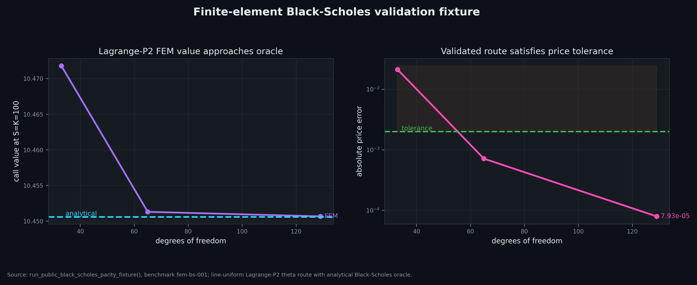
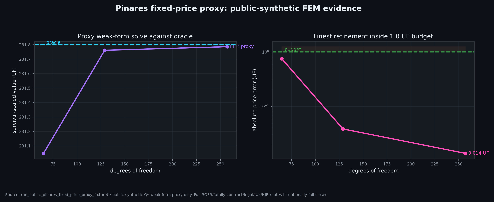
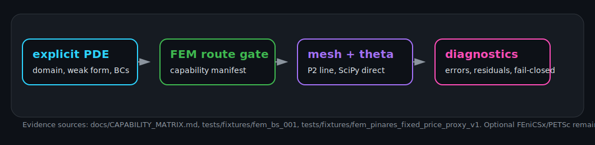

# Finite Element Options

Finite Element Options is an installable, library-first finite-element toolkit for option-pricing PDE validation. The stable import namespace is `finite_element_options`; optional UI, calibration, JAX, FD-compatibility and FEniCSx routes are documented as separate maturity levels rather than implied production features.

Python support: at least 3.11 and below 3.13.

## Validation evidence snapshot







Generated by `uv run --with matplotlib==3.10.3 --with pillow==11.3.0 python scripts/generate_readme_validation_visuals.py`; the deterministic JSON visual QA and provenance report is written to `docs/images/readme_visual_provenance.json`.

Evidence used:

| Fixture | Route | Result |
|---|---|---|
| `fem-bs-001` | line-uniform Lagrange-P2 theta FEM route | final price error `7.93e-5` versus `2.0e-3` tolerance; Delta/Gamma checked against analytical references |
| `PINARES-FEM-FIXED-PRICE-PROXY-V0` | public-synthetic fixed-price weak-form proxy | final proxy error `0.014 UF` versus `1.0 UF` budget; full-family-contract, ROFR, legal/tax, obstacle, jump and HJB routes fail closed |

The Pinares figure is not private project data and is not a real-estate legal/tax valuation. It is a deterministic one-dimensional fixed-price purchase-option proxy under the public `Q*` convention.

## Quickstart

After installing the wheel or an editable checkout, run the Black-Scholes example from an installed-package context:

```python
from finite_element_options.examples.bs_1d import price_call

grid = price_call()
print(round(float(grid[-1].max()), 6))
```

The snippet solves the one-dimensional Black-Scholes example and prints a value from the final output slice. In this repository, the time grid is the forward PDE/output grid `tau`; option-pricing maturity is stated explicitly in examples and analytical oracle calls.

The bundled module form is also executable from an installed wheel:

```bash
python -m finite_element_options.examples.basic_usage
```

## Capability matrix

Public capability claims are generated from `finite_element_options.contracts.capability_matrix` and checked in CI. The full matrix is in [docs/CAPABILITY_MATRIX.md](docs/CAPABILITY_MATRIX.md). A module or demo is not automatically a validated capability.

<!-- capability-matrix:start -->
| Capability | Maturity | Evidence / benchmark | Limitation / absence behavior |
|---|---|---|---|
| `FEM-BS-1D-EUROPEAN` — 1D European Black-Scholes FEM route | validated | tests/test_black_scholes_1d.py<br>tests/test_benchmark_black_scholes.py<br>benchmark:pytest-benchmark:black_scholes_benchmark<br>reference:EuropeanOptionBs analytical oracle | Does not validate American exercise, Heston calibration, or multi-dimensional production claims. |
| `FEM-THETA-TIME-GRID` — Theta-family time integration | validated | tests/test_time_stepper.py<br>tests/test_state_time_coefficients.py<br>benchmark:FEM-THETA-TIME-GRID<br>reference:FR-FEM-006 | Adaptive time stepping, large-scale PETSc variational inequalities, and financial-product validation remain separate capabilities. |
| `FEM-AMERICAN-LCP-REFERENCE` — Reference American lower-obstacle LCP solve | validated | tests/test_american_lcp.py<br>benchmark:FEM-AMERICAN-LCP-REFERENCE<br>reference:FEM-AMERICAN-LCP<br>reference:issue-41 | This is the base SciPy reference solver, not a PETSc/SNES VI route or a full American-product benchmark suite against QuantLib. |
| `FEM-VALIDATION-GATES-V0` — Convergence, arbitrage, manufactured-solution and backend gates | validated | tests/test_validation_gates.py<br>benchmark:FEM-VALIDATION-GATES-V0<br>reference:issue-42 | The default suite is deterministic and lightweight; large external QuantLib/FEniCSx work-precision studies remain separate evidence. |
| `FEM-SOLVER-CACHE-001` — SciPy direct sparse factorization reuse | validated | tests/test_solver_cache_benchmark.py<br>benchmark:FEM-SOLVER-CACHE-001 | Banded, AMG, PETSc and equal-error work-precision routes remain fail-closed until separately evidenced. |
| `FEM-HC-SOLVER-CONTRACT-V0.1` — Released public FEM solver contract | production-qualified | tests/test_fem_backend_capabilities.py<br>tests/fixtures/fem_bs_001/<br>benchmark:fem-bs-001<br>reference:finite-element-options-fem-solver-contract-v0.1 | Contract maturity does not imply every model/backend combination is production-qualified. |
| `PINARES-FEM-FIXED-PRICE-PROXY-V0` — Pinares fixed-price weak-form proxy fixture | validated | tests/test_pinares_fem_proxy.py<br>tests/fixtures/fem_pinares_fixed_price_proxy_v1/<br>benchmark:PINARES-FEM-FIXED-PRICE-PROXY-V0 | ROFR, legal coordination, taxes, HJB controls, obstacles and liquidity/default jumps intentionally fail closed. |
| `FEM-Heston-CIR-MOMENTS` — Heston/CIR moment diagnostics | implemented | tests/test_heston_moments.py<br>reference:FR-FEM-004 | Moment/domain diagnostics are not a full Heston PDE validation or calibration proof. |
| `FEM-ADAPTIVE-REFINE-TRANSFER` — Adaptive mesh refinement with transfer diagnostics | implemented | tests/test_solver.py<br>reference:FR-FEM-008 | Goal-oriented estimators, reversible coarsening and convergence effectivity are not yet production claims. |
| `FEM-FENICSX-EXPERIMENTAL` — Optional FEniCSx backend spike | experimental | tests/test_fenics_solver.py<br>tests/test_benchmark_fenics.py | Not part of the base install and not advertised as a production solver route. Optional: Tests skip explicitly when dolfinx/petsc4py are unavailable. |
| `FEM-FD-COMPAT-DEPRECATED` — Finite-difference compatibility shim | deprecated | tests/test_fd_black_scholes.py | Production finite-difference ownership belongs to finite_difference_options; removal target is published. Optional: The base wheel does not import findiff/pandas/xarray. |
| `FEM-JAX-GREEKS-EXPERIMENTAL` — Optional JAX analytical Greek helper | experimental | tests/test_jax_greeks.py | Does not differentiate the FEM grid solution; numerical-solution sensitivities are separate capabilities. Optional: The base wheel does not import JAX; optional profile gates import it. |
| `FEM-CALIBRATION-RESEARCH` — Bounded pricing calibration adapters | experimental | tests/test_calibrator.py | The package still does not ship a production Heston PDE/Fourier pricing engine; Heston calibration requires an injected, separately validated engine artifact and fails closed for toy/synthetic/polynomial engines. Optional: The base wheel does not import PyMC, ArviZ or Statsmodels. |
| `FEM-STREAMLIT-UI-EXPERIMENTAL` — Streamlit exploration UI | experimental | .github/workflows/ci.yml#optional_imports-ui<br>tests/test_ui_config.py | The Streamlit surface remains exploratory; Heston routes and product-level American benchmarks fail closed until their numerical capabilities land. Optional: The base wheel does not import Streamlit or UI-only plotting packages. |
<!-- capability-matrix:end -->

## Installation

The core wheel keeps optional stacks out of the base install. Use a local wheel-style install for consumers and an editable install constrained by `constraints.txt` for development gates. Optional profiles are published as extras: `fd`, `jax`, `calibration`, `io`, `viz`, `ui`, `validation`, `build`, and `dev`.

```text
python -m pip install .
python -m pip install -e '.[dev]' -c constraints.txt
```

`requirements.txt` is a legacy all-in developer mirror; prefer package metadata and `constraints.txt` for reproducible checks.

## Architecture and ownership

The CI-enforced architecture contract is `docs/architecture_contract.toml`. It records the `finite_element_options` source-layout package topology, optional stack import boundaries and the module ownership table used by [docs/MODULE_OWNERSHIP.md](docs/MODULE_OWNERSHIP.md). Treat the base install as the FEM core; finite-difference compatibility uses the `fd` extra, calibration uses `calibration`, JAX Greeks use `jax`, IO/dataframe helpers use `io`, and UI/plotting code uses `ui` or `viz`.

Launch the optional Streamlit application with the `ui` extra installed via the entry module path `finite_element_options.examples.streamlit_app`. Run the adaptive mesh demo via `python -m finite_element_options.examples.adaptive_mesh_refinement` when plotting dependencies are available. These demos are not maturity upgrades.

## Python API example

This example uses only the base FEM and analytical Black-Scholes APIs. It reports an FEM grid value and separately reports analytical Greeks; those Greeks are not claimed to be derivatives of the numerical FEM grid solution.

```python
import numpy as np

from finite_element_options.core.dynamics_black_scholes import DynamicsParametersBlackScholes
from finite_element_options.core.market import Market
from finite_element_options.core.vanilla_bs import EuropeanOptionBs
from finite_element_options.space.boundary import DirichletBC
from finite_element_options.space.mesh import create_mesh
from finite_element_options.space.solver import SpaceSolver
from finite_element_options.time_integration.stepper import ThetaScheme

market = Market(r=0.03)
dynamics = DynamicsParametersBlackScholes(r=market.r, q=0.0, sig=0.2)
option = EuropeanOptionBs(k=1.0, q=dynamics.q, mkt=market)
mesh, config = create_mesh(extents=[2.0], refine=4)
space = SpaceSolver(mesh=mesh, dynamics=dynamics, payoff=option, is_call=True, config=config)

tau_grid = np.linspace(0.0, 1.0, 20)
values = ThetaScheme(theta=0.5).solve(tau_grid, space, boundary_condition=DirichletBC([]))
node = int(np.argmin(np.abs(space.Vh.doflocs[0] - 1.0)))
fem_price = float(values[-1, node])
analytical_price = float(option.call_from_volatility(tau_grid[-1], 1.0, dynamics.sig))
analytical_delta = float(option.call_delta_from_volatility(tau_grid[-1], 1.0, dynamics.sig))
analytical_volatility_vega = float(option.vega_volatility(tau_grid[-1], 1.0, dynamics.sig))

print(
    f"FEM call={fem_price:.4f}; oracle={analytical_price:.4f}; "
    f"analytical_delta={analytical_delta:.4f}; "
    f"analytical_volatility_vega={analytical_volatility_vega:.4f}"
)
```

## Benchmarking and evidence

Benchmark and validation evidence is linked from the generated capability matrix. The currently validated performance evidence is the Black-Scholes benchmark smoke and the `FEM-SOLVER-CACHE-001` sparse-factorization reuse fixture. Faster routes without equal-error evidence remain experimental or unsupported.

The public Pinares weak-form proxy fixture is documented in [docs/benchmarking.md](docs/benchmarking.md). Regeneration commands and paths are intentionally deterministic, but the proxy remains a numerical compatibility benchmark rather than a family-contract valuation.

## FEniCSx spike

The optional `FenicsSolver` mirrors selected scikit-fem behavior using FEniCSx and UFL. The backend is deliberately optional: CI runs contract tests that are visible when DOLFINx/PETSc are available and skip explicitly otherwise. It is not a base-install or production route.

## Continuous integration

CI evidence includes package builds for Python 3.11 and 3.12, installed-wheel import checks, README example execution from an installed package context, docstring/Ruff/mypy gates, architecture and packaging contracts, coverage, validated benchmark smoke artifacts, optional-profile import gates, `pip-audit`, and a CycloneDX SBOM.

## Local verification

```text
python -m compileall -q src tests scripts
ruff check src tests scripts
pydocstyle src/finite_element_options
mypy --ignore-missing-imports --follow-imports=silent src/finite_element_options/contracts src/finite_element_options/validation scripts/check_ci_contract.py
python scripts/check_architecture_contract.py
python scripts/check_ci_contract.py
python scripts/generate_capability_docs.py --check
python scripts/check_readme_examples.py README.md
uv run --with matplotlib==3.10.3 --with pillow==11.3.0 python scripts/generate_readme_validation_visuals.py
pytest -q tests/architecture --no-cov
pytest -q tests/test_packaging_contract.py --no-cov
pytest -q tests/test_benchmark_black_scholes.py tests/test_pinares_fem_proxy.py tests/test_capability_matrix_docs.py --no-cov
```

## Project structure

```text
pyproject.toml                      PEP 621 package metadata and extras
src/finite_element_options/         installable core package namespace
src/finite_element_options/examples/ installed-package examples and Streamlit entry point
docs/CAPABILITY_MATRIX.md           generated maturity/evidence matrix
docs/benchmarking.md                benchmark and fixture notes
docs/images/                        generated README validation visuals
requirements.txt                    legacy all-in developer requirements mirror
constraints.txt                     CI/test compatibility constraints
tests/                              pytest-based test suite
```

## Roadmap

See [docs/ROADMAP.md](docs/ROADMAP.md) for development guidelines and prompt templates.

## License

MIT. This project is provided as-is without warranty.
