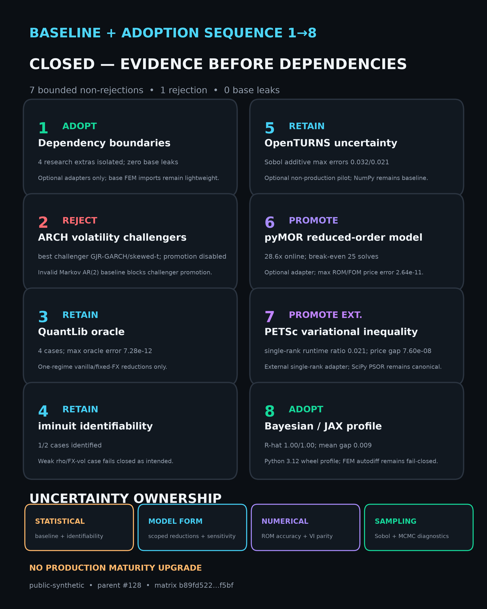

# Adoption sequence 1–8 closeout

## Decision

**Close parent epic [#128](https://github.com/googa27/finite_element_options/issues/128).** The prerequisite research baseline [#129](https://github.com/googa27/finite_element_options/issues/129) landed first, and all eight adoption children are closed through merged, evidence-gated changes. The matrix below is adoption-only: seven routes were adopted, retained, or promoted behind explicit boundaries; one challenger promotion was rejected because its baseline was invalid. No result upgrades production or capability-matrix maturity.

- Baseline evidence: [`REGIME_SWITCHING_QUANTO_RESEARCH.md`](REGIME_SWITCHING_QUANTO_RESEARCH.md)
- Canonical adoption matrix: [`evidence/adoption_sequence_closeout_2026-09-05.json`](evidence/adoption_sequence_closeout_2026-09-05.json)
- Matrix SHA-256: `b89fd522ca13a782130382f7495db2f237c078451becd83041dc3a6a4fd8f5bf`
- Visual SHA-256: `2b326ea720c6853c1ffefe95d2e07fd92ca153c0b3ff3c1996892e6b9101671f`
- Regenerate: `uv run --python 3.11 --extra dev python scripts/generate_adoption_sequence_closeout.py`
- Privacy: public-synthetic research evidence only

## Final matrix

| Step | Issue | Decision | Evidence | Boundary |
|---:|---:|---|---|---|
| 1 | [#130](https://github.com/googa27/finite_element_options/issues/130) | **ADOPT** isolated dependency boundaries | 4 research extras isolated; zero optional-stack base leaks | Optional adapters only; base FEM imports stay lightweight. |
| 2 | [#131](https://github.com/googa27/finite_element_options/issues/131) | **REJECT** challenger promotion | Best candidate was GJR-GARCH/skewed-t | The Markov AR(2) baseline did not converge, so comparison was invalid. |
| 3 | [#132](https://github.com/googa27/finite_element_options/issues/132) | **RETAIN** QuantLib oracle | 4 cases; maximum QuantLib/analytical error `7.28e-12` | One-regime vanilla and fixed-FX quanto reductions only. |
| 4 | [#133](https://github.com/googa27/finite_element_options/issues/133) | **RETAIN** iminuit profiles | 1/2 cases identified | The deliberately weak correlation/FX-volatility case fails closed. |
| 5 | [#134](https://github.com/googa27/finite_element_options/issues/134) | **RETAIN** OpenTURNS adapter | Additive Sobol max first/total errors `0.032` / `0.021` | Optional non-production pilot; NumPy remains the baseline. |
| 6 | [#135](https://github.com/googa27/finite_element_options/issues/135) | **PROMOTE** optional pyMOR adapter | `28.6×` median online speedup; break-even 25 solves; max ROM/FOM price error `2.64e-11` | Full-order FEM remains the fallback outside the verified envelope. |
| 7 | [#136](https://github.com/googa27/finite_element_options/issues/136) | **PROMOTE EXTERNAL** PETSc VI adapter | Single-rank PETSc/PSOR runtime ratio `0.021`; price gap `7.60e-08` | Single-rank external route only; SciPy projected SOR remains canonical. |
| 8 | [#137](https://github.com/googa27/finite_element_options/issues/137) | **ADOPT** isolated Bayesian profiles | PyMC/NumPyro R-hat `1.00/1.00`; mean gap `0.009`; zero divergences | Python 3.12 wheel profile; automatic FEM differentiation remains fail-closed. |

## Uncertainty ownership

| Class | Evidence-backed conclusion | Guardrail |
|---|---|---|
| **Statistical** | ARCH promotion is rejected because the baseline fit did not converge. iminuit distinguishes an identified case from a deliberately weak case. | Do not rank volatility challengers until a valid baseline exists; do not force identification. |
| **Model form** | QuantLib validates only the declared reductions. OpenTURNS reports model-form sensitivity within a public-synthetic one-regime pilot. | Do not extrapolate to the full regime-switching PDE or intrinsic fair-value distribution. |
| **Numerical** | pyMOR passes held-out price/Greek and residual gates with `28.6×` online speedup. PETSc matches the American VI reference at single rank. | Keep full-order FEM and SciPy PSOR canonical fallbacks; no distributed PETSc claim. |
| **Sampling** | OpenTURNS uses 64 propagation samples and a 128-point Sobol base; finite-sample intervals may cross zero. PyMC/NumPyro pass R-hat, ESS, predictive, and divergence gates. | Treat Sobol and MCMC results as bounded smoke evidence, not universal convergence proof. |

## Portfolio guardrails retained

- `statsmodels` and `scikit-fem` remain the lightweight statistical/FEM baselines.
- Optional libraries do not leak into the base-wheel import contract.
- PDP remains an external data-product owner; no PDP runtime or internal import was added.
- Evidence is immutable, hash-bound, public-synthetic, and replayed through installed-wheel or explicitly external profiles.
- Every adoption is reversible through its documented fallback or fail-closed trigger.
- Capability-matrix production maturity remains unchanged.
