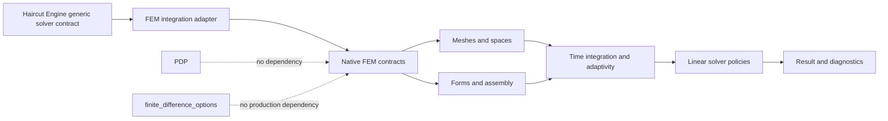

# Finite Element Options — Architecture Specification

**Status:** Canonical target architecture  
**Audit baseline:** 2026-06-26  
**Repository:** `googa27/finite_element_options`  
**Default branch:** `master`  
**Portfolio epic:** [`haircut-engine` #62](https://github.com/googa27/haircut-engine/issues/62)  
**Local modernization epic:** [#43](https://github.com/googa27/finite_element_options/issues/43)

---

## 1. Architectural mission

Finite Element Options provides reusable and independently verifiable FEM mechanisms for parabolic and related pricing PDEs. It is a numerical library first; product examples, calibration, visualization and downstream integrations are outer adapters.

The core invariant is:

```text
explicit PDE + conventions
        ↓
typed FEM problem
        ↓
mesh + finite-element space + weak form + boundary treatment
        ↓
time integration + sparse linear-solver policy
        ↓
solution + sensitivities + residual/error/performance diagnostics
```

No layer may invent missing model coefficients or hide an unsupported boundary, discretization or solver choice.

Issue #55 applies this rule to the credit-risk example: the supported constant-intensity defaultable zero-coupon claim is state-free, so it is represented by the scalar ODE/closed-form reduced-form reference rather than a fake one-node FEM domain. A stochastic-intensity credit PDE must declare its state process, generator, domain, boundaries and benchmark evidence before becoming a FEM route.

## 2. Federated portfolio context



Repository ownership:

- `finite_element_options` owns reusable FEM numerical mechanisms and FEM-specific diagnostics.
- `haircut-engine` owns domain/CASCADE policy, solver routing and portfolio evidence.
- `finite_difference_options` owns production FD mechanisms.
- `PDP` owns data acquisition and data-product contracts.

Cross-repository integration uses independently versioned wheels, semantic contracts and parity fixtures—not Git submodules or source-tree imports.

## 3. Audit findings and decisions

| Finding | Risk | Decision / owner |
|---|---|---|
| Historical `setup.py` declared `packages=['src']` | Built wheels did not represent the intended nested package API | #44 replaces it with PEP 621 metadata and `src/finite_element_options` package discovery |
| Historical README/source imported `src.*` | Checkout success masked broken distribution installs | #44 removes `src` as a public package and adds clean-wheel tests |
| Historical metadata lived outside `pyproject.toml` | Runtime dependencies, Python support, extras and entry points were undefined | #44 makes `pyproject.toml` the package source of truth |
| Historical `requirements.txt` combined `scikit-fem[all]`, UI, FD, JAX, PyMC, dataframes and test tools | Large mandatory environment and fragile compatibility | #44 splits core dependencies from published extras and dev/test groups |
| FEM, FD, products, calibration, plotting and Streamlit coexist in one distribution | Ambiguous ownership and reverse dependencies | Ownership cleanup remains under #50; #44 keeps optional stacks out of core dependencies |
| Historical `src/time` package name | Conceptual collision with standard-library `time` | #44 renames it to `finite_element_options.time_integration` |
| Historical CI tested only Python 3.11 and one all-dependencies environment | No package/profile or support-edge confidence | #44 adds build/install checks; #59 pins Actions, tests profile-specific wheels, uploads evidence artifacts, and adds supply-chain audit/SBOM gates |
| Benchmark runs are not accuracy-normalized | Faster but less accurate results can look better | #59 keeps a validated benchmark smoke artifact; calibrated performance budgets remain a successor release-maturity task |
| Agent guide points to `main` while default is `master` and records state in `.gemini_project` | Workflow drift and non-versioned source of truth | Correct branch and make GitHub/docs/tests authoritative |
| External backend integration is aspirational | Private-module coupling risk | Thin entry-point adapter under #49 after package/interface gates |

## 4. Architectural principles

1. **Finite-element mechanics are the core.** Product, UI and calibration concerns remain outside.
2. **Strong form, weak form and time transform are explicit.** No hidden sign or measure convention.
3. **Boundary treatment is part of the method.** It is not a post-processing detail.
4. **Sparse and diagnostic by default.** Assembly and solve produce auditable metadata.
5. **Correctness before acceleration.** Analytical/manufactured convergence precedes JAX, Numba, PETSc or GPU claims.
6. **One stable namespace.** A clean wheel is the consumer contract.
7. **Optional capability, optional dependency.** Research and application ecosystems are extras.
8. **No duplicate production ownership.** FD migrates to the FD repository; Haircut domain policy stays in Haircut.
9. **Fail closed.** Unsupported dimensions, coefficients, BCs and outputs are rejected before solve.
10. **Independent release compatibility.** Use entry points, capability manifests and shared parity fixtures.

## 5. Target package topology

```text
src/finite_element_options/
  __init__.py                  # narrow stable API
  contracts/
    problem.py                 # domain-neutral PDE/FEM problem records
    configuration.py           # mesh, element, time and solver policies
    result.py                  # solution, sensitivities and diagnostics
  mesh/
  spaces/
  forms/
  boundary_conditions/
  assembly/
  time_integration/
  adaptivity/
  linear_solvers/
  sensitivities/
  diagnostics/
  validation/
  integrations/
    haircut_backend.py
  _compat/                     # time-bounded legacy import shims only

examples/                      # installed-package examples
apps/                          # optional Streamlit application
benchmarks/                    # reproducible benchmark registry/harness
experiments/                   # explicit research-only profiles

tests/
  architecture/
  contract/
  unit/
  integration/
  numerical/
  performance/
```

Do not create a subpackage merely for visual symmetry. Boundaries are justified by dependency direction, semantic ownership, optional installation or independent testing.


The machine-readable architecture contract is `docs/architecture_contract.toml`. It is the CI-enforced source of truth for the `src/finite_element_options` package-root allowlist, repository-root Python-file policy, topology-count ratchet, and optional-stack import boundaries; update it with `tests/architecture` and `scripts/check_architecture_contract.py` in every hierarchy-changing PR.

## 6. Dependency direction

```text
contracts and diagnostics schemas
             ↑
mesh / spaces / forms / boundary conditions
             ↑
assembly / time integration / linear solvers / adaptivity / sensitivities
             ↑
validation and integration adapters
             ↑
examples / apps / research workflows
```

Hard rules:

- `contracts` cannot import scikit-fem internals, JAX, FEniCSx, PETSc, pandas, PyMC, plotting, Streamlit or Haircut.
- Mesh, spaces, forms and assembly cannot import products, calibration, UI, examples or integration adapters.
- Linear solver policies may depend on SciPy core and optional solver adapters, but core modules do not import optional HPC packages eagerly.
- The Haircut adapter imports canonical public FEM APIs, not legacy/private modules.
- Examples and apps depend inward on the installed package; core never imports examples/apps.
- No module imports the distribution as `src`.
- Architecture tests enforce these rules.

## 7. Mathematical problem contract

A scalar linear parabolic problem is represented explicitly, for example:

\[
\partial_\tau u
= \nabla\!\cdot\!\left(A(x,\tau)\nabla u\right)
+ b(x,\tau)\cdot\nabla u
- c(x,\tau)u
+ f(x,\tau),
\]

with domain, time orientation, initial/terminal condition and boundary partitions supplied by the caller.

A weak form must document integration by parts, boundary flux terms and sign conventions. A representative bilinear form may be written as

\[
a_\tau(u,v)
= \int_\Omega \nabla v^\top A\nabla u\,dx
+ \int_\Omega v\,b\cdot\nabla u\,dx
+ \int_\Omega c\,v u\,dx
+ a_{\partial\Omega}(u,v),
\]

while the mass form is

\[
m(u,v)=\int_\Omega vu\,dx.
\]

The exact signs depend on the declared strong-form convention; code and fixtures must agree. Product adapters cannot silently reinterpret them. Problem identity/hash is distinct from FEM method controls so Pinares, Haircut, and other consumers can ask FD/FEM/analytical methods to solve the same claim without rewriting its economics.

## 8. Native contract model

```text
FEMProblem
├── state domain and coordinates
├── time interval and orientation
├── coefficient fields and regularity
├── initial/terminal and source terms
├── typed boundary specifications
└── units and convention metadata

FEMConfiguration
├── mesh family, refinement and identity
├── element family/order and quadrature
├── theta/time-step/start-up policy
├── linear solver/preconditioner/tolerances
├── adaptivity and transfer policy
└── dtype/device/resource limits

FEMResult
├── solution field and coordinates
├── point/functionals and sensitivities
├── residual/convergence/error estimates
├── mesh/refinement/transfer diagnostics
├── assembly/factorization/solve timings
├── warnings/regularization/failure trace
└── version and reproducibility metadata
```

Public contracts are immutable or snapshot-able and serialization-tested. `tests/fixtures/quant_problem_specs/pinares_fixed_price_proxy.json` is the public-synthetic compatibility smoke for the Pinares fixed-price option proxy: it verifies that Pinares owns the financial problem and this backend owns only mesh/element/weak-form/linear-solver controls.

## 9. Meshes and spaces

Mesh APIs declare dimension, coordinate system, topology, geometric mapping, boundary markers, refinement lineage and deterministic identity. Element spaces declare family, polynomial order, continuity and quadrature assumptions.

Validation includes:

- nondegenerate elements and orientation;
- domain and boundary-marker consistency;
- dimensional compatibility;
- interpolation/projection shape checks;
- refinement lineage and state-transfer stability.

Mesh I/O and external generators belong to optional adapters.

## 10. Forms and assembly

Assembly separates mass, diffusion, advection, reaction, source and optional coupled terms. Matrix/operator properties are surfaced where mathematically expected: symmetry, positivity, definiteness, sparsity and condition proxies.

Rules:

- Variable coefficients are evaluated consistently at the declared quadrature or interpolation policy.
- Boundary contributions are not dropped silently.
- Essential boundary elimination modifies right-hand sides correctly.
- Sparse matrices remain sparse unless a measured small-system path explicitly permits dense conversion.
- Reassembly and cache keys include every mathematical dependency.

## 11. Boundary conditions

Typed BC hierarchy:

```text
BoundaryCondition
├── Dirichlet(value, boundary_set)
├── Neumann(flux, boundary_set)
├── Robin(alpha, beta, value, boundary_set)
└── optional periodic/asymptotic adapter when validated
```

Each BC declares whether it contributes to the weak form, algebraic elimination or both. Tests inspect boundary residuals, interior RHS correction and corner/intersection policy.

## 12. Time integration and state transfer

The canonical package name is `time_integration`, not `time`.

Theta-family integration is explicit:

\[
\left(M+\theta\Delta\tau K_{n+1}\right)u_{n+1}
=
\left(M-(1-\theta)\Delta\tau K_n\right)u_n
+\Delta\tau\left[\theta f_{n+1}+(1-\theta)f_n\right],
\]

subject to the repository's declared operator sign. Time-dependent operators require explicit assembly/reuse rules. Rannacher smoothing, adaptive stepping and remeshing transfer are separate capabilities with independent validation.

## 13. Linear solver architecture

A solver policy declares:

- applicable matrix properties and problem sizes;
- direct or iterative method;
- preconditioner/factorization options;
- absolute/relative tolerances and iteration limit;
- reuse/invalidation policy;
- fallback policy, if any;
- diagnostics and failure semantics.

Potential profiles include SciPy sparse direct/iterative baseline, optional AMG and optional PETSc. Broad exception fallback is prohibited. A failure returns a failed result/exception with residual and context, not a numerical field presented as success.

## 14. Adaptivity architecture

Adaptivity pipeline:

```text
solve → estimate → mark → refine/coarsen → transfer → verify → continue
```

The estimator, norm or goal functional, marking fraction, mesh limits, transfer operator and stopping condition are typed. Diagnostics include estimator totals/local values, marked elements, degrees of freedom, transfer error, effectivity where reference error exists and target-functional evolution.

## 15. Sensitivities and Greeks

Sensitivity methods are distinct adapters:

- solution interpolation and finite differences;
- tangent or adjoint solve;
- automatic differentiation in an optional JAX-capable route;
- parameter bump and re-solve.

Each result names the differentiated parameter/state coordinate, units, evaluation point, method, smoothing policy and error evidence. Nonsmooth payoff behavior is explicitly tested rather than hidden by optimistic tolerances.

## 16. Backend plugin architecture

Candidate entry point:

```toml
[project.entry-points."haircut.solver_backends"]
finite_element_options = "finite_element_options.integrations.haircut_backend:create_backend"
```

The adapter:

1. exposes lightweight identity and capability metadata;
2. validates solver-contract version and request compatibility;
3. maps generic records to native immutable FEM contracts;
4. selects only explicit validated native policies;
5. solves and normalizes values, sensitivities and diagnostics;
6. records backend/package/contract and benchmark IDs.

The adapter cannot import Haircut domain/application, PDP, UI or calibration code. It advertises only capabilities backed by repository-local tests and shared parity #64/#74.

Issue #64 adds `finite_element_options.contracts.backend_capabilities` and `finite_element_options.validation.black_scholes_parity` as executable FEM adapter evidence. `FEMRouteRequest.from_quant_problem_spec` consumes the same public-synthetic vanilla-call JSON fixture validated by Haircut Engine and finite_difference_options, preserves schema version, measure, numeraire, units, valuation/vintage timing, time-domain or maturity information, boundary details, mesh/element policy, linear solver policy and requested outputs, and fails closed before mesh/weak-form allocation for unsupported dimensions, variational terms, boundaries, exercise styles, outputs or controls. The default manifest intentionally advertises only the validated one-dimensional uniform-line/Lagrange-P2/theta/SciPy-direct route; higher-dimensional, adaptive, American, jump and HJB/control capabilities remain unsupported until their own parity evidence lands. The `fem-bs-001` parity fixture solves the public-synthetic Black-Scholes call against the Haircut analytical oracle with named endpoint boundary enforcement, deterministic weak-form metadata, typed boundary metadata, value/Delta/Gamma error evidence, and deterministic mesh/time refinement export.

Issue #74 publishes the public arxiv-lab contract artifacts in `tests/fixtures/fem_bs_001/` alongside the executable report: `problem_spec.json` (fixture/problem spec), deterministic mesh/time-step configuration and boundary metadata, `result_export.json` (convergence rows and summary), and explicit equal-error comparison policy for parity consumers.


## 17. Ownership cleanup

| Existing concern | Target treatment |
|---|---|
| FEM mesh/space/form/assembly | Stable core |
| Time stepping and FEM state transfer | Stable core |
| Sparse solver/factorization policies | Core plus optional solver adapters |
| `fdsolver.py` or production FD routes | Migrate/remove; optional time-bounded benchmark oracle only |
| Black–Scholes/Heston/product classes | Thin validation/example adapters, not core ownership |
| Calibration and statistical workflows | Optional profile or downstream consumer |
| pandas/xarray/Arrow persistence | Optional experiment/interop profile |
| Streamlit/sidebar/plotting | `apps/` and `viz` extra |
| JAX/Numba/FEniCSx/PETSc | Explicit experimental/optional profiles |
| Duplicate `src/examples` and top-level examples | One installed-package example tree |

Moves should first preserve behavior, then change numerics in separate commits/PRs. Legacy imports live only in `_compat` with warnings and removal milestones.

## 18. Dependency profiles and packaging

Use PEP 621 metadata with an explicit build backend, `requires-python`, bounded runtime dependencies, package discovery under `src`, optional dependencies and entry points. Use development dependency groups for tests, lint, typing, documentation, build and audit.

The minimal wheel includes only core numerical dependencies. `scikit-fem[all]` is not acceptable for core because it makes optional features mandatory. FEniCSx/PETSc platform constraints are documented and tested in dedicated environments.

A checked lock reproduces development CI; published metadata uses compatible ranges. Build with sources disabled where relevant and test the wheel outside the repository.

## 19. Performance architecture

Optimization order:

1. establish analytical/manufactured correctness and observed order;
2. profile assembly, boundary application, factorization, solve, transfer and post-processing;
3. eliminate dense conversions and repeated work;
4. reuse matrices/factorizations with complete cache keys;
5. compare solver/preconditioner and optional accelerator routes at equal error;
6. set regression budgets after noise characterization.

Benchmark metadata includes problem/mesh/config hash, DOFs, nonzeros, time steps, versions, hardware/BLAS/threads, dtype/device, cold/warm/JIT/cache state, stage timings, memory, iterations/residuals and achieved error.

## 20. Validation architecture

Test layers:

| Layer | Purpose |
|---|---|
| Architecture | Import boundaries, namespace, optional imports and public API |
| Contract | Native problem/config/result serialization and compatibility |
| Unit | Mesh, forms, BC algebra, assembly, solver policy and transfers |
| Numerical | Manufactured/analytical solutions, convergence, invariants and Greeks |
| Integration | End-to-end mesh→assembly→time→result and optional adapters |
| Parity | Shared Haircut backend fixtures from #64/#74 |
| Performance | Accuracy-adjusted stage/memory regressions |
| Packaging | sdist/wheel content, clean install, missing-extra behavior |

Default tests are deterministic and offline. Heavy FEniCSx/PETSc/JAX/Bayesian profiles run in explicit jobs.

## 21. Architecture fitness gates and CI release topology

The package and CI gates for #44/#59 are:

```bash
python scripts/check_architecture_contract.py
python scripts/check_ci_contract.py
pytest -q tests/architecture tests/test_packaging_contract.py --no-cov
python -m build --sdist --wheel
python -m twine check dist/*
ruff check src tests scripts
mypy --ignore-missing-imports --follow-imports=silent src/finite_element_options/contracts src/finite_element_options/validation scripts/check_ci_contract.py
python -m pip_audit --progress-spinner=off --skip-editable
cyclonedx-py environment --of JSON -o sbom.json
```

These gates are ratcheted around the real `src/finite_element_options` package: new package-root source modules/packages require an architecture-doc and TOML-contract update, FEM core cannot import application or research-only stacks, the base package import stays lightweight, a built wheel must not export a top-level package named `src`, and `.github/workflows/ci.yml` must keep pinned Actions plus explicit package/test/profile/supply-chain jobs.

Ownership cleanup #50 remains the successor for retiring FD/application duplicates. Until then, the architecture gate carries explicit baseline exceptions only for the known FD compatibility module and keeps optional-profile import checks for FEniCSx/PETSc/JAX isolated from core packaging evidence.

| Job | Purpose | Policy |
|---|---|---|
| `package` | Build sdist/wheel on Python 3.11 and 3.12, run `twine check`, install the wheel outside the checkout, and upload dist artifacts | Blocking |
| `test` | Dev-profile tests, Ruff, mypy over contract-critical modules, docstrings, architecture/CI/packaging contracts, coverage XML, JUnit, and validated benchmark smoke artifact | Blocking |
| `optional_imports` | Clean-wheel imports for `fd`, `jax`, `calibration`, `viz`, and `ui` extras | Blocking for advertised extras |
| `supply_chain` | `pip-audit --skip-editable`, CycloneDX SBOM, and uploaded evidence | Blocking |
| FEniCSx/PETSc/MPI | Platform-specific solver adapters | Scheduled/opt-in until support is stable |
| Haircut parity | Clean-wheel plugin and shared fixtures | Blocking for compatibility changes |
| Performance budgets | Accuracy-equivalent runtime/memory thresholds | Successor release-maturity policy |

Python 3.11-only CI and one all-dependencies environment are insufficient evidence of support. The issue #59 workflow intentionally exercises clean wheels and optional profiles separately so skipped optional-backend tests cannot masquerade as production support.

## 22. Compatibility and deprecation policy

This policy maps #57 to its successor issues: #44 creates the replacement namespace and package metadata, #50 retires duplicate ownership and predecessor modules, and #49 connects the Haircut adapter only through the replacement public API after those gates pass.

- Distribution API and Haircut solver-contract versions are independent.
- The compatibility matrix is owned by Haircut #65 and mirrored in release notes.
- Unknown combinations are unsupported.
- Public deprecations name replacement, warning version, removal version/date and migration example.
- Shims contain no new numerical behavior.
- Breaking weak-form, boundary, time or sensitivity semantics require versioned contract changes and migration fixtures.

## 23. Migration plan

### Phase 0 — Freeze coupling growth

- Do not add mandatory optional dependencies or product/UI imports into numerical core.
- Add characterization tests before moves.

### Phase 1 — Package foundation

- #44 complete: `pyproject.toml`, real `finite_element_options` namespace, build metadata, clean-wheel CI, and `src` import-package retirement.
- #59 complete: full-SHA-pinned GitHub Actions, installed-wheel/profile CI, CI-contract tests, coverage/JUnit/benchmark artifacts, `pip-audit`, and CycloneDX SBOM generation.
- Architecture contracts and package/install/CI tests guard the public namespace, workflow supply chain, and optional dependency split.
- Contributor guidance uses the repository's `master` default branch.

### Phase 2 — Canonical FEM modules

- Continue moving mesh, spaces, forms, BCs, assembly, time integration and solvers into sharper subpackages without behavior changes.
- `time_integration` is the canonical replacement for historical `src/time`.
- Add `_compat` shims only where downstream usage is known.

### Phase 3 — Ownership cleanup

- Execute #50 inventory.
- Remove/migrate production FD behavior.
- Move UI, plotting, calibration and research stacks behind extras or out of core.
- Consolidate examples.

### Phase 4 — Typed contracts and correctness

- Complete local numerical, interface, Greek and solver-policy blockers (#33–#48).
- Ensure capabilities reflect validated behavior only.

### Phase 5 — Backend integration

- Implement #49 entry-point adapter.
- Run shared Haircut conformance/parity from installed wheels.
- Publish compatibility under Haircut #65.

### Phase 6 — Release maturity

- Establish minimum/latest/profile CI, performance budgets and supply-chain evidence.
- Begin legacy import removal only after the deprecation window and downstream evidence.

## 24. Architecture decisions

| ADR | Decision | Rationale |
|---|---|---|
| FEM-ADR-001 | Real `finite_element_options` package under `src`; `src` is not the import package | Correct wheel behavior and public API |
| FEM-ADR-002 | FEM mechanics are core; FD/application/domain concerns are outer or migrated | Clear ownership and maintainability |
| FEM-ADR-003 | `time_integration` replaces `time` | Avoid ambiguity and communicate responsibility |
| FEM-ADR-004 | Minimal `scikit-fem`, not `scikit-fem[all]`, in core | Keep optional ecosystems optional |
| FEM-ADR-005 | Entry-point plugin for Haircut integration | Independent releases and lazy discovery |
| FEM-ADR-006 | Shared generic contract plus native FEM contracts | Avoid Haircut-domain coupling while preserving FEM-specific policy |
| FEM-ADR-007 | Correctness and convergence precede performance | Numerical credibility |
| FEM-ADR-008 | Compatibility shims are time-bounded boundary code | One canonical implementation |
| FEM-ADR-009 | GitHub/docs/tests are authoritative, not agent scratch state | Durable governance |
| FEM-ADR-010 | Profile-specific CI replaces one all-dependency job | Honest support and maintainable dependencies |
| FEM-ADR-011 | GitHub Actions are pinned to full commit SHAs | Immutable CI supply-chain inputs |
| FEM-ADR-012 | CI produces coverage, benchmark, package and SBOM artifacts | Reviewable release evidence |

## 25. Issue map

- Numerical verification and model correctness: #33–#42
- Modernization and package foundation: #43, #44, #59
- Interfaces, calibration, Greeks and solver policy: #45–#48
- Haircut backend adapter: #49, FEM parity fixture extension: `finite_element_options` #74
- Ownership and duplicate retirement: #50
- Portfolio protocol/parity/release: `haircut-engine` #62–#65

## 26. References

- PyPA `pyproject.toml`: https://packaging.python.org/en/latest/guides/writing-pyproject-toml/
- PyPA `src` layout: https://packaging.python.org/en/latest/discussions/src-layout-vs-flat-layout/
- PyPA plugin discovery: https://packaging.python.org/en/latest/guides/creating-and-discovering-plugins/
- Python `importlib.metadata`: https://docs.python.org/3/library/importlib.metadata.html
- uv dependencies and groups: https://docs.astral.sh/uv/concepts/projects/dependencies/
- scikit-fem: https://scikit-fem.readthedocs.io/
- SciPy sparse linear algebra: https://docs.scipy.org/doc/scipy/reference/sparse.linalg.html
- PETSc: https://petsc.org/release/
- DOLFINx: https://docs.fenicsproject.org/dolfinx/main/python/

---

*End of canonical Finite Element Options architecture specification.*
