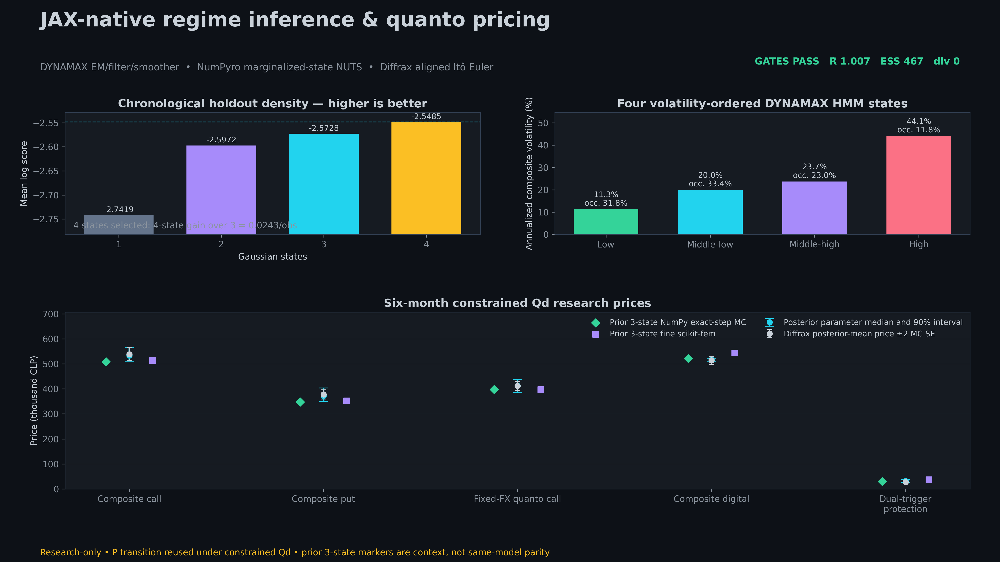

# JAX-native regime inference and quanto-pricing study

**Status:** passed research evidence — not market calibrated and not production ready<br>
**Executed:** 2026-09-07<br>
**Evidence SHA-256:** `5909572c546ca7ca3449e2b6180fc3fcb27aa78013c3f0b5ed4fc523a97ab756`<br>
**Python 3.12 lock SHA-256:** `42f83eb5da5716b7f228bdb94338beb5b552d9fe0fdb866449e5cb31b8c46a7c`<br>
**Python 3.12 test-tool lock SHA-256:** `ab7d270889b7d1b74e7723668d972173b86e2e5d763d6385ad6566d5ac418af0`<br>
**Python 3.12 CI-tool lock SHA-256:** `5dbd4f3f15dce41e455b4cde0cb453c23782379cc4b37fef0db526ec75e0580b`<br>
**Visual lock SHA-256:** `8110cfc79dcaffaf734730272ae5db84174a25a3304241a964422de2988891b6`<br>
**PNG/PDF SHA-256:** `50f927f21b0134b494aa87e0bc87d1d806d1066b0cacefa757c589c051cfd3ef` / `a73e912a850a7de0d473350d77ae48c90a3e2ca8af274d543fa2db65b2f3c026`

<p align="center">
  
</p>

## Result in one sentence

A four-state bivariate Gaussian HMM wins the converged chronological holdout comparison; a reference-identified empirical-Bayes NumPyro analysis passes strict two-chain diagnostics under weak, reference, and strong priors; and the daily discrete-regime Diffrax pricing route passes likelihood, exact-step, analytical, martingale, monotonicity, historical-oracle, and uncertainty-separation gates.

These are historical-return research results. They do not identify option-implied volatility, a regime-risk premium, or a unique risk-neutral transition law.

## Owned boundaries

| Concern | Maintained library or boundary | Exact role |
|---|---|---|
| Gaussian HMM | DYNAMAX 1.0.2 | Full-covariance EM, filtering, smoothing, sampling, and marginal-likelihood oracle |
| Bayesian inference | NumPyro 0.21.0 | NUTS over continuous HMM parameters; categorical states are analytically marginalized |
| Array/autodiff runtime | JAX/JAXLIB 0.11.1 | Log-space forward recursion, exact simulation, diagnostics, and pricing arrays |
| SDE abstraction | Diffrax 0.7.2 | Euler solve forced to each daily regime boundary and checked pathwise against the exact log update |
| Deterministic comparator | statsmodels 0.14.6 | VAR(1) fit and chronological sequential holdout score on the same bivariate split |
| Input data | Immutable PDP export | Caller-supplied, content-addressed public-research observations; no PDP internal imports |
| Regime conversion | SciPy matrix logarithm/exponential | Embeddability diagnostic only; pricing does not simulate a CTMC |

Primary API references: [DYNAMAX HMM API](https://probml.github.io/dynamax/api.html), [NumPyro MCMC](https://num.pyro.ai/en/stable/mcmc.html), [Diffrax documentation](https://docs.kidger.site/diffrax/), and [JAX documentation](https://docs.jax.dev/).

## Data contract

| Field | Value |
|---|---|
| Series | S&P 500 `^GSPC`; USDCLP `CLP=X` |
| Requested window | 2010-01-01 to 2026-09-04, end-exclusive |
| Source level rows | 4,346 |
| Valid joint level rows | 4,185 |
| Missing/unparseable equity rows | 153 |
| Missing/unparseable FX rows | 6 |
| Invalid FX rows quarantined | 2 (`2014-04-10`, `2016-12-22`; FX below 100) |
| Return observations | 4,184 aligned bivariate daily log-return rows |
| Observed return window | 2010-01-05 through 2026-09-03 |
| Units at loader boundary | Decimal daily log return |
| Units inside HMM | Percent daily log return |
| Classification | `public_research` |
| Archive SHA-256 | `ca2debc4fcbf9bd6fb958a5cfcb986a3e8080c7923418c9d2367fcd2d9a99721` |
| Levels SHA-256 | `aa7ab317266bf37463e27aba9a4e990fa349bb0a6e0aefb5741e93480e0f79f4` |

The loader fails closed on archive/levels hash mismatches, non-finite constructed returns, and non-positive terminal spots. It audits and excludes missing, unparseable, or implausible joint-level rows. The loader and every later calibration/pricing-oracle member read share the same immutable in-memory byte snapshot that passed SHA-256 validation; the filesystem path is never reopened during the run. Returns are adjacent-valid-row log differences after exclusions, with no calendar-gap rescaling. The v2 evidence serializes the complete row-count partition, quarantine dates/reasons, and return-construction rule while publishing no raw observations or local home paths.

## Statistical formulation

For bivariate return observation $y_t$ and discrete state $z_t$, the fitted physical-measure model is:

```math
\boxed{
\begin{aligned}
\textcolor{purple}{z_t}\mid z_{t-1}
&\sim \mathrm{Categorical}\!\left(\textcolor{purple}{P_{z_{t-1},:}}\right),\\
\textcolor{cyan}{y_t}\mid z_t=k
&\sim \mathcal N\!\left(\textcolor{orange}{\mu_k},\textcolor{green}{\Sigma_k}\right).
\end{aligned}}
```

NumPyro does not sample the discrete path. A pure-JAX log-space forward recursion integrates it out and contributes the scalar marginal likelihood through `numpyro.factor`. Repository and DYNAMAX marginal log likelihoods agree to an absolute error of `1.09e-11`.

### Chronological model selection

Every HMM candidate receives three deterministic 250-iteration EM starts. Only finite converged starts are eligible; each candidate requires at least two. Selection uses the untouched chronological 15% holdout, never in-sample likelihood.

| States | Converged starts | Held-out mean log score | Decision |
|---:|---:|---:|---|
| 1 | Exact Gaussian baseline | −2.741920 | Rejected |
| 2 | 3/3 | −2.597171 | Rejected |
| 3 | 3/3 | −2.572829 | Rejected |
| **4** | **2/3** | **−2.548545** | **Selected** |
| statsmodels VAR(1) | Deterministic comparator | −2.706077 | Beaten by selected HMM |

The four-state gain over three states is `0.024284` mean log score per holdout observation. The nonconverged K=4 start is retained in the JSON diagnostics and excluded from selection. All three full-data K=4 starts converged.

### Full-data state summary

States are canonicalized by composite equity-plus-FX volatility.

| State | Annualized composite volatility | Smoothed occupancy | End-sample filtered probability |
|---:|---:|---:|---:|
| 1 | 11.27% | 31.79% | 76.15% |
| 2 | 19.96% | 33.36% | 18.95% |
| 3 | 23.74% | 23.05% | 4.77% |
| 4 | 44.11% | 11.80% | 0.13% |

## Empirical-Bayes NumPyro evidence

The DYNAMAX fit supplies volatility-ordered reference centers for the NumPyro priors. This is an **empirical-Bayes, reference-identified analysis**: posterior intervals are conditional on that reference and do not include uncertainty from selecting or estimating it.

All profiles use the same 4,184 observations, 300 warmup steps, 300 retained draws per chain, and two chains.

| Prior profile | Maximum R-hat | Minimum ESS | Divergences | Finite | Gate |
|---|---:|---:|---:|---|---|
| Weak | 1.0050 | 370.1 | 0 | Yes | Pass |
| Reference | 1.0074 | 466.7 | 0 | Yes | Pass |
| Strong | 1.0054 | 481.6 | 0 | Yes | Pass |

Publication thresholds are maximum R-hat `1.05`, minimum ESS `100`, zero divergences, finite draws, at least 200 draws per chain, and at least two chains. The reference posterior's worst R-hat coordinate is `transition_matrix[9]`; its lowest-ESS coordinate is `log_scales[7]`. No coordinate is hidden as weakly identified. The largest weak/strong posterior-mean price change relative to the reference profile is 3.65% under common pricing random numbers.

## Pricing experiment

Pricing retains the fitted daily physical transition matrix under a constrained CLP-domestic measure as an explicit research assumption. The continuous factors satisfy regime-conditioned log dynamics:

```math
\boxed{
\begin{aligned}
\textcolor{cyan}{d\log S_t}
&=\underbrace{\textcolor{orange}{\left(r_f-q-\rho_k\sigma_{S,k}\sigma_{X,k}-\frac{1}{2}\sigma_{S,k}^2\right)}}_{\textcolor{orange}{\text{domestic-measure quanto drift}}}\,dt
+\underbrace{\textcolor{green}{\sigma_{S,k}\,dW^S_t}}_{\textcolor{green}{\text{equity diffusion}}},\\
\textcolor{cyan}{d\log X_t}
&=\underbrace{\textcolor{blue}{\left(r_d-r_f-\frac{1}{2}\sigma_{X,k}^2\right)}}_{\textcolor{blue}{\text{FX carry}}}\,dt
+\underbrace{\textcolor{green}{\sigma_{X,k}\,dW^X_t}}_{\textcolor{green}{\text{FX diffusion}}},\\
\mathrm{Corr}(dW^S_t,dW^X_t)&=\textcolor{purple}{\rho_k}.
\end{aligned}}
```

Diffrax uses `Euler` with `StepTo` at all 126 daily regime boundaries. Because coefficients are constant within each aligned interval in log coordinates, the JAX scan supplies a conditionally exact update. Maximum Diffrax-versus-exact pathwise error is `4.44e-16`; a stochastic Brownian-bridge refinement from 126 to 252 steps also passes at machine precision.

### Six-month research prices

Values are CLP. The posterior column is a deterministic chain-stratified summary across 128 draws (64 from each chain), each repriced with 131,072 paths and common random numbers. The evidence also records even/odd split-subsample quantile stability relative to the full interval half-width. The computational interval expands the parameter-repricing interval by separately recorded conditional Monte Carlo error.

| Contract | Diffrax posterior-mean price ± 2 MC SE | Empirical-Bayes 90% interval | Conservative computational 90% interval | MC SE / posterior half-width | Split-quantile delta / half-width |
|---|---:|---:|---:|---:|---:|
| ATM composite call | 537,503.86 ± 25,132.65 | [509,617.20, 564,208.19] | [505,959.23, 567,866.15] | 0.081 | 0.165 |
| ATM composite put | 376,252.50 ± 18,027.19 | [349,586.35, 401,884.56] | [347,021.60, 404,449.31] | 0.060 | 0.153 |
| ATM fixed-FX quanto call | 410,223.39 ± 18,368.52 | [385,173.02, 435,886.80] | [382,471.50, 438,588.32] | 0.065 | 0.188 |
| Composite digital | 513,701.33 ± 15,259.52 | [511,378.40, 520,658.58] | [509,160.68, 522,876.29] | **0.291** | 0.083 |
| Dual-trigger protection | 27,212.80 ± 5,026.60 | [26,363.89, 35,977.15] | [25,576.32, 36,764.72] | 0.100 | 0.057 |

## Independent verification

| Gate | Executed result |
|---|---:|
| DYNAMAX/JAX marginal-likelihood absolute error | `1.09e-11` |
| Diffrax/exact maximum pathwise error | `4.44e-16` |
| Brownian-bridge exact/Diffrax errors | `1.11e-16` / `3.89e-16` |
| CTMC diagnostic reconstruction residual | `1.42e-15` |
| Foreign-FX discounted-martingale z-score | `0.198` |
| Domestic-value foreign-equity martingale z-score | `−0.020` |
| Worst one-state analytical-oracle absolute z-score | `0.672` |
| Worst archived NumPy exact-step parity absolute z-score | `1.173` |
| Three-seed minimum state-decoding accuracy | 92.28% |
| Three-seed maximum transition RMSE | 0.00797 |
| Three-seed maximum relative volatility error | 6.51% |
| Prior-sensitivity maximum relative price change | 3.65% |
| Named promotion gates | All pass |

The SciPy-derived CTMC generator is only an embeddability/law diagnostic. Actual pricing simulates the fitted **daily discrete HMM**, not a continuous-time regime process. The public config therefore enforces 252 steps per year and maturities aligned to whole fitted trading-day intervals; conditional Diffrax refinement may split diffusion increments within a fitted day, but it never reapplies the daily transition matrix at a subdaily frequency.

Accepted runs require at least four retained draws per chain for finite split-chain diagnostics. Every pricing route obeys a 16,515,072 per-draw path-step ceiling, and posterior repricing additionally obeys a 2,113,929,216 total path-step ceiling equal to the executed canonical allocation. Only the exact canonical publication config raises posterior repricing to 131,072 paths; noncanonical runs treat `pricing_paths` as a true upper bound and may adapt it downward for total-work safety. Non-finite NumPyro diagnostics serialize as `null`, set `finite=false`, and fail promotion.

## Reproducibility and supply chain

The isolated profile contains JAX/JAXLIB 0.11.1, NumPyro 0.21.0, DYNAMAX 1.0.2, Diffrax 0.7.2, statsmodels 0.14.6, fastprogress 1.0.3, and pinned `tfp-nightly` version `0.26.0.dev20260907`. DYNAMAX's TFP layer emits deprecation warnings under this JAX version; those warnings are retained as an upgrade/reassessment trigger.

```text
uv venv --python 3.12 /tmp/feo-jax-regime
uv pip install --python /tmp/feo-jax-regime/bin/python --require-hashes \
  -r environments/jax-regime-py312/ci-requirements.lock
uv pip install --python /tmp/feo-jax-regime/bin/python --require-hashes \
  -r environments/jax-regime-py312/requirements.lock
uv pip install --python /tmp/feo-jax-regime/bin/python --require-hashes \
  -r environments/jax-regime-py312/test-requirements.lock
/tmp/feo-jax-regime/bin/python -m build --wheel --no-isolation --outdir dist
uv pip install --python /tmp/feo-jax-regime/bin/python --no-deps \
  dist/finite_element_options-*.whl

JAX_PLATFORMS=cpu JAX_ENABLE_X64=1 \
XLA_FLAGS=--xla_force_host_platform_device_count=2 \
/tmp/feo-jax-regime/bin/python -m pytest -q \
  external_tests/jax_regime/test_profile.py --no-cov

JAX_PLATFORMS=cpu JAX_ENABLE_X64=1 \
XLA_FLAGS=--xla_force_host_platform_device_count=2 \
/tmp/feo-jax-regime/bin/python scripts/run_jax_regime_study.py \
  --input "$PDP_ARCHIVE" \
  --num-states 4 --em-iters 250 --warmup 300 --samples 300 \
  --chains 2 --pricing-paths 4096 --publish-canonical --verify

/tmp/feo-jax-regime/bin/python -m pytest -q \
  tests/validation/test_jax_regime_study_evidence.py --no-cov

uv venv --python 3.12 /tmp/feo-jax-regime-visual
uv pip install --python /tmp/feo-jax-regime-visual/bin/python \
  --require-hashes -r environments/jax-regime-visual-py312/requirements.lock
MPLCONFIGDIR=/tmp/feo-mpl-cache \
/tmp/feo-jax-regime-visual/bin/python scripts/generate_jax_regime_plot.py \
  --publish-canonical
```

`PDP_ARCHIVE` must name the caller-controlled content-addressed archive. Non-synthetic execution has no home-directory fallback; nonpublication output defaults to `/tmp`; and canonical writes require the exact configuration plus `--publish-canonical`. The evidence sidecar and validation test fail closed on drift. Runtime science, test tooling, CI build/audit/SBOM tooling, and visuals use separate hash locks; fixed visual versions/metadata have a CI byte-comparison gate.

## Scope and non-claims

1. Historical return fitting is not option-surface calibration.
2. Reusing the physical transition matrix under the domestic pricing measure is a scenario assumption, not an identified regime-risk premium.
3. NumPyro intervals are empirical-Bayes and conditional on the DYNAMAX reference fit.
4. Common-random-number posterior repricing separates but does not eliminate conditional Monte Carlo error.
5. Flat domestic and foreign rates and zero dividend yield are experiment inputs, not calibrated curves.
6. Diffrax is a verified extension boundary, not an accuracy improvement over the conditionally exact aligned log update.
7. The prior three-state scikit-fem/NumPy study remains a rollback and matched-parameter numerical oracle; its failed discontinuous-payoff FEM results are not promoted by this JAX experiment.
8. The artifact is `research_only=true`, `market_calibrated=false`, and `production_ready=false`.
